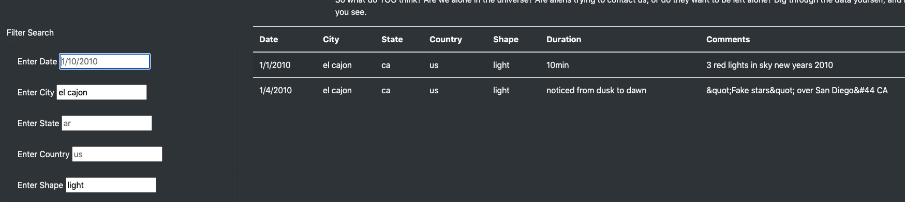

# UFOs
## The Truth is Out There

### Overview of the analysis:
Overview of Project: Explain the purpose of this analysis.

The following project was to create a webpage and dynamic table of in-depth analysis of UFO sightings. The UFO sightings are filtered based on criteria inserted by the user. The user can filter on multiple criteria at once. The following criteria can be filtered:

  - Date
  - City
  - State
  - Country
  - Shape

## Results:

Dana and others can use this new webpage by typing in any one of the 5 criterias either individually or collectively. As we can see from the screenshot, there are examples of the inputs provided for formatting purposes as well. 

Once a criteria is entered, the table beside the filter will automatically filter to the matching results. Be sure to use lowercase letters and single spacing between words. The matching results in the table includes the following information:

  - Date: Date the UFO was spotted
  - City: The city of the UFO sighting
  - State: The state of the UFO sighting
  - Country: The country of the UFO sighting
  - Shape: The shape of the referenced UFO
  - Duration: The length of time the UFO was within sight
  - Comments: These comments describe the visual of the UFO sighting

*When utilizing the website, please remember to use lower capitalization and follow the sample formatting that is in the filter cells!

**As mentioned, one to several criterias can be inserted to recieve results. 

The following is an example of City: "el cajon" 1/1/2010 and the Shape: "light":

This next example is based solely on the criteria of triangular shaped UFO sightings:

### Summary:

In conclusion, I will discuss the discovered drawback of this design, as well as two recommendations for further development.

**The Drawback:
  - The primary drawback of this design is that the filter is case sensitive. If the words do not match in both spelling and cases, the filter will not provide results. 

**Two recommendations for further development:
  1. Make the filter less sensitive to formatting so that results can be provided regardless of the alphabet case and perhaps provide a drop down for the country, city, and state codes, as well as a calendar in place of written dates. These actions will make the file much more uniform in inserting data so that as new data becomes available, visitors will not be missing information due to basic grammatical and formatting errors.
  2. Another idea for further development is to provide a section for others to send in information of their own sightings to add to the collection of information. This could further feed the community in both information and participation due to an ongoing growth of available information and the fact that they too can share their experiences. Returning visitors will often be on the look out for new info, hereby providing steady and repeat traffic to the website itself.

